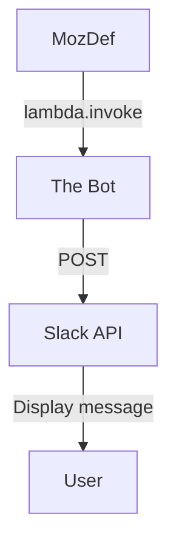
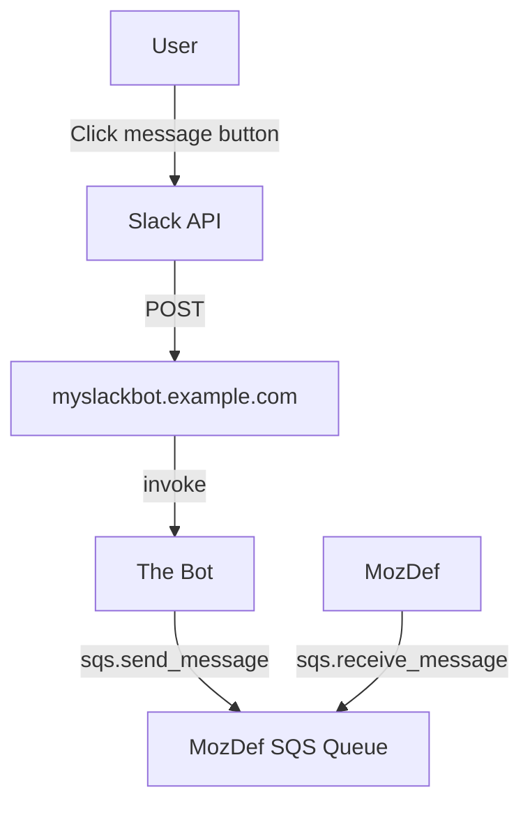

# MozDef-Triage-Bot
A Slack bot that facilitates triaging MozDef alerts by automating outreach to Mozillians


## Flow

* MozDef : The running instance of the MozDef SIEM
* The Bot : Serverless AWS Lambda Code triggered either by calls to the API Gateway 
  or via direct AWS Lambda invocation with the AWS API
* Slack : The Slack API

### MozDef Triggers the Bot

MozDef Triggers the Bot

1. MozDef, using the dedicated [bot AWS user](https://github.com/mozilla/MozDef-Triage-Bot/blob/master/cloudformation/slack-triage-bot-user.yaml), 
   [invokes The Bot's AWS Lambda function](https://github.com/mozilla/MozDef/blob/bca65c274d363d56c417caada64be05e8585cd68/alerts/actions/triage_bot.py#L497)
   passing The Bot a unique `identifier`, the user to pose the question 
   to, the name of the alert to send the user, the summary text of the alert to 
   send the user and the level of confidence MozDef has in the identity of the user
2. The Bot [sends a direct message to the user on Slack](https://github.com/mozilla/MozDef-Triage-Bot/blob/f36b293c37e407e96a20c3b225ed10467a835d0c/cloudformation/functions/slack_triage_bot_api/app.py#L235)
   with the question via the Slack API


<details>
  <summary>Click to see the mermaid code</summary>


</details>

### The User Response

1. The user clicks one of the buttons in the Slack message, indicating their response
2. Slack POSTs to https://myslackbot.example.com/slack/interactive-endpoint
   with the details of the user's response
3. The Bot receives the POST and
   1. [Emits an event to MozDef](https://github.com/mozilla/MozDef-Triage-Bot/blob/f36b293c37e407e96a20c3b225ed10467a835d0c/cloudformation/functions/slack_triage_bot_api/app.py#L344-L351)
      via [an SQS queue created for MozDef to consume](https://github.com/mozilla/MozDef-Triage-Bot/blob/f36b293c37e407e96a20c3b225ed10467a835d0c/cloudformation/functions/slack_triage_bot_api/config.py#L13)
      with a MozDef event with a category of triagebot , the [unique `identifier`](https://github.com/mozilla/MozDef-Triage-Bot/blob/f36b293c37e407e96a20c3b225ed10467a835d0c/cloudformation/functions/slack_triage_bot_api/app.py#L345)
      that MozDef [created above](https://github.com/mozilla/MozDef-Triage-Bot/blob/f36b293c37e407e96a20c3b225ed10467a835d0c/cloudformation/functions/slack_triage_bot_api/app.py#L460)
      when it triggered the bot, the identity of the user and the user's response
   2. [POSTs back](https://github.com/mozilla/MozDef-Triage-Bot/blob/f36b293c37e407e96a20c3b225ed10467a835d0c/cloudformation/functions/slack_triage_bot_api/app.py#L358-L361)
      to Slack to update the Slack UI to show that The Bot received the user's 
      button click. This adds the `Understood, thanks for letting us know.` annotation
      to the Slack message.


<details>
  <summary>Click to see the mermaid code</summary>


</details>

## Deployment

In these instructions we'll assume that the domain name that the bot is deployed
to is `myslackbot.example.com`. You can find the actual domain name of the API in the
`PROD_DOMAIN_NAME` or `DEV_DOMAIN_NAME` variables in the [`Makefile`](Makefile). 

* [Create the Slack App](https://api.slack.com/apps?new_app=1)
  * Go to the `Collaborators` section of the configuration and add all the users
    that will administer the bot.
  * Go to the `App Home` section
    * In the `Your App’s Presence in Slack` area click `Edit` next to `App Display Name`
      and set the `Display Name (Bot Name)` to `mozilla_security_bot` and the `Default Name`
      to `mozilla_security_bot` 
  * Go to the `Interactivity & Shortcuts` section
    * In the `Interactivity` area set the `Request URL` to `https://myslackbot.example.com/slack/interactive-endpoint`
    * In the `Select Menus` area set the `Options Load URL` to `https://myslackbot.example.com//slack/options-load-endpoint`
  * Go to the `OAuth & Permissions` section of the configuration
    * Ignore the `Bot User OAuth Access Token` as we don't use it
    * Update the `Redirect URLs` to include the `https://myslackbot.example.com/redirect_uri`
      URL.
  * Scopes
    * The Bot Token Scopes needed are
      * `users:read.email` : https://api.slack.com/methods/users.lookupByEmail
      * `users:read` : This is required because of users:read.email
      * `im:write` : https://api.slack.com/methods/conversations.open
      * `chat:write` : https://api.slack.com/methods/chat.postMessage
  * Install the App
* Create the AWS IAM user that MozDef will use to interact with the Lambda function
  and SQS queue
  `make deploy-mozdef-slack-triage-bot-user`
* Determine the Slack Client Secret
  * This can be done by going to the Slack App's configuration (at a URL like
    `https://api.slack.com/apps/ABCDE123AB/general`).
  * Navigate to https://api.slack.com/apps
  * Click your app to get to the configuration page
  * Find the `Client Secret` in the `App Credentials` section
* Run the make command for the environment you want
    ```shell script
    PROD_SLACK_CLIENT_SECRET=0123456789abcdef0123456789abcdef make deploy-mozdef-slack-triage-bot-api
    ```
    
    or
    
    ```shell script
    DEV_SLACK_CLIENT_SECRET=0123456789abcdef0123456789abcdef make deploy-mozdef-slack-triage-bot-api-dev
    ```
    
    depending on the account
* Provision a Slack OAuth token for the bot by browsing to the 
  `https://myslackbot.example.com/authorize` URL of the deployed API in any 
  browser. 
  By hitting this `/authorize` URL, it will cause the API to contact Slack and
  request an OAuth token which the bot will then store in AWS SSM Parameter Store.
  This step need only be done once as, from this point on, the bot will continue
  to use this token which is stored in the Parameter Store.

## Testing

You can test invoking the function by passing the email address of the user
you want to send a message to and calling

```shell script
EMAIL_ADDRESS=user@example.com make test-mozdef-slack-triage-bot-api-invoke
```

which will pass

```json
{
    "identifier":"9Zo02m4B7gIfixq3c4Xh",
    "alert":"duo_bypass_codes_generated",
    "identityConfidence":"lowest",
    "summary":"DUO bypass codes have been generated for your account. ",
    "user":"user@example.com"
}
```

to the API which will return the JSON response from Slack of the message that
was sent to the user.

You can also test the API Gateway interface by running

```shell script
make test-mozdef-slack-triage-bot-api-http
```

which will hit the `/test` API endpoint and get back a 200 `API request received`

You can also visit the `/error` endpoint to get a 400 or any other endpoint to get a 404

## Discovering the SQS URL containing user responses

To discover the URL of the SQS queue into which user responses are sent, call

```shell script
make discover-sqs-queue-url 
```

which will return a value like

```json
{"result": "https://sqs.us-west-2.amazonaws.com/012345678901/MozDefSlackTriageBotAPI-SlackTriageBotMozDefQueue-ABCDEFGHIJKL"}
```

## Discovering the Lambda function name

Call the [lambda:ListFunctions](https://docs.aws.amazon.com/lambda/latest/dg/API_ListFunctions.html)
API and filter the results based on the name. You can see an example of this by
running the make command

```shell script
make discover-lambda-function-name 
```

which will return a value like `MozDefSlackTriageBotAPI-SlackTriageBotApiFunction-1N9KLDX1926F3`

## Fetching User API Keys

You can fetch the User API keys from the CloudFormation outputs

```shell script
make show-user-credentials
```

## Integrating MozDef and the MozDef-Triage-Bot

The CloudFormation templates in this repo provision an AWS IAM user as well as
the SQS queue which MozDef receives messages from.

To integrate MozDef with the bot
* Deploy the `slack-triage-bot-user.yaml` CloudFormation template
* Deploy the `slack-triage-bot-api.yaml` CloudFormation template
* Gather the 3 sets of information you'll need to put into the `MozDef-deploy`
  Ansible repo to configure MozDef
  * The API keys 
    * either look at the stack outputs in the user stack or run 
      `make show-user-credentials`
  * The SQS Queue name, AWS region and AWS account ID
    * either look at the stack outputs in the api stack or run 
      `make discover-sqs-queue-url`
  * The Lambda function name
     * either look at the stack outputs in the api stack or run 
       `make discover-lambda-function-name`
  
The API keys will grant MozDef permission to both invoke the lambda function
as well as receive messages from the SQS queue

## Mozilla's deployments in Slack

* [Mozilla deployment](https://api.slack.com/apps/AS6G90NUT/general)
* [mozilla-sandbox-SCIM deployment](https://api.slack.com/apps/AR6G404SH/general)

More Mozilla specific information can be found in mana : https://mana.mozilla.org/wiki/display/SECURITY/Mozilla+Security+Bot+or+MozDef+Triage+Bot
