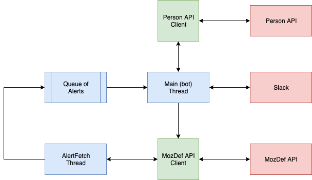

# MozDef Alert Triage Bot 0.1 Specification

**This specification is a living document until the release of v0.1.**

The first release of the MozDef Alert Triage Bot will implement a minimum
viable product (MVP) containing features that will facilitate the automation
of the triaging process for a few specific MozDef alerts.  The portion of the
codebase that exists within this repository will provide an implementation for
only the component of the triage bot that facilitates interactions with users
on Slack.  This specification documents the design and requirements of those
components implemented within [MozDef](https://github.com/mozilla/mozdef)
itself, however the source code for those components will reside within
MozDef's own repository.

## User Stories

Version 0.1 must satisfy the following user stories.

**As an incident responder**, I want to be able to easily determine which of the
alerts emitted by MozDef will be handled automatically so that I can adjust to
not having to handle them.

**As an incident responder**, I want to know when the triage bot is already in
the process of investigating an alert so that I can determine when it is
not working as expected and not take on work I do not have to.

**As a Mozillian**, I would like to be contacted in a friendly and non-intrusive
way with information that explains in simple terms everything I need to
understand and know how to respond.

**As one of Mozilla’s Slack admins**, I would like to be able to easily
understand how the triage bot will interface with Slack so that I can
manage permissions.

**As one of Mozilla’s Slack admins**, I would like to be able to easily
determine who to reach out to with questions about the triage bot.

## Functional Components



### Web Server

The web server component has the responsibility of facilitating interactions
with Slack.  This will include:

1. Receiving information about alerts from MozDef.
2. Sending messages to users on Slack.
3. Receiving requests from Slack when a user responds to a message.
4. Sending information about a user's response back to MozDef.


The web server will, as illustrated, consist of several
[AWS Lambda](https://aws.amazon.com/lambda/) functions that each interact with
a [DynamoDB](https://aws.amazon.com/dynamodb/) instance containing information
about jobs being processed.  Most activity will be triggered by events from an
[AWS API Gateway](https://aws.amazon.com/api-gateway/).

#### API Gateway

The API Gateway will serve the endpoints described in our
[API documentation](../api/v0_1.md).

#### Data Store

The data store instance will be treated as a hash-table store whose contents will be
typed according to the `DataStore` type defined in
[Alert Processing Records](#alert-processing-records).

#### Alert Notification

The Alert Notification lambda function will be invoked in response to events
from API Gateway indicating that the Alert Plugin component has sent a new
alert description for processing.  This function has the responsibility of
creating and updating `UserRecord`s.

All new jobs will have a [ttl](
https://docs.aws.amazon.com/amazondynamodb/latest/developerguide/TTL.html)
set to trigger the Job Timeout function to handle cleanup.

#### User Response

The User Response lambda function will be invoked in response to events from
API Gateway indicating that Slack has [sent a request](
https://api.slack.com/messaging/interactivity/enabling#setting_up_interactions)
to inform us about a user's response to an interactive message.  This function
has the responsibility of updating the `response` field of
`AlertProcessingRecord`s.

#### Notify User

The Notify User lambda function will be invoked in response to a new job being
appeneded for a user by the Alert Notification function.  It has the
responsibility of invoking the Slack API to
[send an interactive message](https://api.slack.com/methods/chat.postMessage)
to a user asking if they are aware of the activity that triggered an alert.

#### Status Update

The Status Update lambda function will be invoked when an
`AlertProcessingRecord` is updated with response from a user.  This function
has the responsibility of sending `UserResponseMessage`s to the SQS worker.

#### Job Timeout

The Job Timeout lambda function will be invoked when an `AlertProcessingRecord`
has its timeout exceeded.  This function has the responsibility of sending a
`UserResponseMessage` with a `response` field of `"none"` to the SQS worker if
the request has not been responded to before deleting the
`AlertProcessingRecord`.

### Alert Action

Within MozDef, an alert action would fire each time one of any supported events
are triggered.  This action would send some simple identifying information to
the web server component, along with the alert summary text to be forwarded on
to the relevant user.  This component has two core responsibilities:

1. Given an alert from MozDef, determine the email address belonging to the
user identified in the alert.
2. Send an HTTP POST request to the web server component containing information
identifying the alert and the user.

The implementation of this component will reside within the
[MozDef](https://github.com/mozilla/mozdef) repository.

### SQS Worker

The end of the communication pipeline would be implemented as an SQS worker
designed to ingest messages from the web server component identifying an alert
and indicating the user(s)'s response.  This worker would update a new `status`
field associated with alerts via MozDef's REST API, which would also require an
additional endpoint.

This component has one responsibility, which is to update the status of alerts
described by messages from the web server component, applying the following
mapping from user response to alert status.

| [Response](#user-response-messages) | [Status](#alert-statuses) |
| --------- | ------------ |
| yes       | acknowledged |
| no        | escalated    |
| wrongUser | manual       |
| timeout   | manual       |

The implementation of this component will reside within the
[MozDef](https://github.com/mozilla/mozdef) repository.

## Additional Requirements

### MozDef REST API Endpoint

In order for the SQS Worker component to update the status of an alert, an
endpoint will be added to MozDef's REST API to facilitate such updates.  This
endpoint would accept information identifying an alert to which one or more
users have responded as well as information indicating the response(s) given.

### MozDef Alerts Page UI

An addition will be made to MozDef's "Alerts" page, adding a column to the
existing table of alerts within which the `status` of the alert will be
displayed.  An alert's status will be one of a pre-defined set of statuses
and will communicate to incident responders whether the Triage Bot has
processed the alert.

## Data Models

The following models describe what data is required to implement the features
that each component is responsible for.  They are described using
[TypeScript](https://www.typescriptlang.org/docs/handbook/advanced-types.html)
syntax.

### Alert Triage Requests

The following `AlertLabel` type enumerates all of the alerts that the alert
action component will forward.

```typescript
// A value of type `AlertLabel` is one of the strings below.
type AlertLabel
  = "sensitive_host_session"
  | "duo_bypass_codes_used"
  | "duo_bypass_codes_generated"
  | "ssh_access_sign_releng"
```

* [sensitive_host_session](https://github.com/mozilla/mozdef_generic_alerts/blob/master/rules/ssh_open_crit.json)
* [duo_bypass_codes_used](https://github.com/mozilla/mozdef_generic_alerts/blob/master/rules/duosecurity_bypass_used.json)
* [duo_bypass_codes_generated](https://github.com/mozilla/mozdef_generic_alerts/blob/master/rules/duosecurity_bypass_generated.json)
* [ssh_access_sign_releng](https://github.com/mozilla/MozDef/blob/master/alerts/ssh_access_signreleng.py)

Requests sent to the web server containing information identifying alerts are
described here.  The complete specification for the API endpoint resides in
the [API documentation](../api/v0_1.md).

```typescript
type AlertTriageRequest = {
  // A unique identifier belonging to the alert.
  "identifier": string,

  // A label that identifies what kind of alert is being reported.
  "alert": AlertLabel,

  // A textual description of the alert which will be sent to the user.
  "summary": string,

  // The email address of the user whose activity triggered the alert.
  "email": string
}
```

Version 0.1 of the Triage Bot will support alerting for only one user at a
time.

### Alert Processing Records

The web server component will utilize a data store to record information about
alerts that it is processing so that it can make decisions about when to
message users and what information to send back to MozDef.  Information in
this data store will be represented using the following data structures.

```typescript
type AlertProcessingRecord = {
  // A list of requests received from MozDef to ask a user about an alert.
  // We record each request so that we can automatically send updates regarding
  // each one once a response regarding the first is received.
  "requests": Array<AlertTriageRequest>,

  // The user's response to the message about this alert, if any.
  // Note that `UserResponse` is defined under User Response Messages.
  "response": null | UserResponse,

  // The time at which the request was received.
  "received": Date
}

// A mapping whose keys are the shared labels used to identify supported alerts
// and whose values are complete records.
type UserRecord = {
  [key: AlertLabel]: AlertProcessingRecord
}

type Email = string

// Top-level data structure maps a user's email to the records describing
// alerts being processed for that user.
type DataStore = {
  [key: Email]: UserRecord
}
```

This structure is intended to facilitate fast lookup for a user's processing
records and simple, reliable management of records.  While this does result in
information from `AlertProcessingRecord`s being duplicated to create the keys
for this structure, doing so enables the web server component to easily
retrieve relevant information given a single `AlertTriageRequest`.

### User Response Messages

The User Response Message is sent from the web server to SQS and then on to
MozDef to communicate the user's response from the web server back to MozDef.
The web server component will instruct Slack to present users with a simple
interactive message asking whether an alert was triggered by activity that
user is aware of or not and will also offer the option to indicate that they
were the wrong user to contact.

The following `UserResponse` type enumerates all of the values that may be used
to indicate a user's response to a message.  Note that, rather than
representing no response (i.e. due to a timeout) as `null`, we encode this
response in the `"none"` value.

```typescript
type UserResponse
  = "yes"
  | "no"
  | "wrongUser"
  | "none"
```

The message sent from the web server component to the sqs worker takes the
following form.

```typescript
type UserResponseMessage = {
  // The unique identifier tied to the alert that was responded to.
  "identifier": string,

  // Indicates how the user responded, if they did so before a timeout.
  "response": UserResponse
}
```

### Alert Statuses

In order to account for all of the states an alert can be in with regards to
being triaged by this bot, the following statuses are defined to make up a
complete set of all possible statuses that an alert can have.

The following `AlertStatus` type enumerates all of the values that an alert's
status can take.

```typescript
type AlertStatus
  = "manual"
  | "inProgress"
  | "acknowledged"
  | "escalated"
```

Each status has a specific meaning in the context of being handled by the
triage bot.

* `manual` - Requires intervention by a human incident responder.
* `inProgress` - The alert is in the process of being triaged by the bot.
* `acknowledged` - The alert was acknowledged by the Mozillian / Contributor.
* `escalated` - The alert was escalated by the Mozillian / Contributor.

In the case where a user responds to a question with `invalid`, an alert's
status will be reverted back to `manual` from `inProgress`.

## Disclaimers

Future versions of the Triage Bot specification may want to account for some
cases and conditions that are not being addressed in v0.1.

### Authentication

At present, there is no means for the alert plugin component in MozDef to
authenticate itself to the web server component.  This means that anyone able
to send a well-formed request to the server could fill up the alert queue,
potentially halting functionality and incurring significant operation costs.
