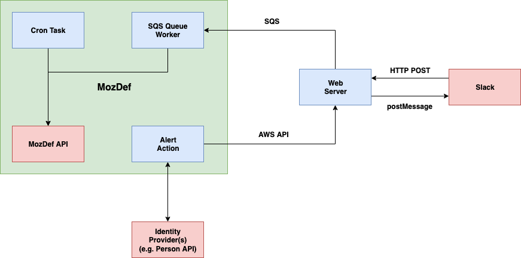

# MozDef Alert Triage Bot 0.2 Specification

**This specification is a living document until the release of v0.2.**

The first release of the MozDef Alert Triage Bot will implement a minimum
viable product (MVP) containing features that will facilitate the automation
of the triaging process for a few specific MozDef alerts.  The portion of the
codebase that exists within this repository will provide an implementation for
only the component of the triage bot that facilitates interactions with users
on Slack.  This specification documents the design and requirements of those
components implemented within [MozDef](https://github.com/mozilla/mozdef)
itself, however the source code for those components will reside within
MozDef's own repository.

## User Stories

Version 0.2 must satisfy the following user stories.

**As an incident responder**, I want to be able to easily determine which of the
alerts emitted by MozDef will be handled automatically so that I can adjust to
not having to handle them.

**As an incident responder**, I want to know when the triage bot is already in
the process of investigating an alert so that I can determine when it is
not working as expected and not take on work I do not have to.

**As a Mozillian**, I would like to be contacted in a friendly and non-intrusive
way with information that explains in simple terms everything I need to
understand and know how to respond.

**As one of Mozilla’s Slack admins**, I would like to be able to easily
understand how the triage bot will interface with Slack so that I can
manage permissions.

**As one of Mozilla’s Slack admins**, I would like to be able to easily
determine who to reach out to with questions about the triage bot.

## Functional Components



### Web Server

The web server component has the responsibility of facilitating interactions
with Slack.  This will include:

1. Receiving information about alerts from MozDef.
2. Sending messages to users on Slack.
3. Receiving requests from Slack when a user responds to a message.
4. Sending information about a user's response back to MozDef.

The web server component will be implemented as a single
[AWS Lambda](https://aws.amazon.com/lambda/) function backed by a
[DynamoDB](https://aws.amazon.com/dynamodb/) instance storing information about
alerts received. The data store will be treated as a hash-table store whose
contents will be typed according to the `DataStore` type defined in
[Alert Processing Records](#alert-processing-records).

### Alert Action

Within MozDef, an alert action will be triggered each time one of any supported
events are triggered.  This action would send some simple identifying
information to the web server component, along with the alert summary text to
be forwarded on to the relevant user.  This component has the following
responsibilities:

1. Given an alert, determine the email address belonging to the user identified.
2. Query the REST API for similar alerts regarding the same user and either
    1. Send an HTTP POST request to the web server component containing
    information identifying the alert and the user or
    2. Create or update a `DuplicateChain` to track the alert that triggered
    the alert action until a response from the user is received.

To notify the web server component about alerts, the alert action component
will invoke the web server lambda function directly using the AWS API.  This
will allow the alert action to authenticate itself to the web server using
a key pair generated for a dedicated [IAM](https://aws.amazon.com/iam/) user.

The alert action will make use of a table stored in the
[MongoDB](https://www.mongodb.com/) instance that stores alerts in MozDef
to store information about duplicate alerts that triggered the action before
the user responds regarding the original. The type of data stored in this new
table will be the `DuplicateChain` type defined in
[Duplicate Alert Trackers](#duplicate-alert-trackers).

The implementation of this component will reside within the
[MozDef](https://github.com/mozilla/mozdef) repository.

### SQS Worker

The end of the communication pipeline is an SQS worker designed to ingest
messages from the web server component identifying an alert and indicating
the user's response.  This worker would update a new `status` field associated
with alerts via MozDef's REST API.

This component has one responsibility, which is to update the status of alerts
described by messages from the web server component, applying the following
mapping from user response to alert status.

| [Response](#user-response-messages) | [Status](#alert-statuses) |
| --------- | ------------ |
| yes       | acknowledged |
| no        | escalated    |
| wrongUser | manual       |
| timeout   | manual       |

The implementation of this component will reside within the
[MozDef](https://github.com/mozilla/mozdef) repository.

### Cron Task

Periodically, a [Cron](https://github.com/mozilla/MozDef/tree/master/cron) task
will be run to:

1. Retrieve `DuplicateChain`s from the MozDef API.
2. Check, for each `(alert, user)` pair, to see if there is an alert whose status
has been updated based on the user's response via Slack.
3. Update all of the statuses of the duplicate alerts found to match that of the
original alert.

This process has the result of effectively "replaying" a user's response to one
alert so that it is not necessary to message them about each duplicate alert
received within some timeframe.

The implementation of this component will reside within the
[MozDef](https://github.com/mozilla/mozdef) repository.

## Additional Requirements

### Alert Status Update REST API Endpoint

In order for the SQS Worker component to update the status of an alert, an
endpoint will be added to MozDef's REST API to facilitate such updates.  This
endpoint would accept information identifying an alert to which one or more
users have responded as well as information indicating the response given.

### Fetch Duplicate Chains REST API Endpoint

At least one API endpoint will be required to facilitate the retrieval of
`DuplicateChain`s.

* The alert action component will need to be able to search for entries
corresponding to a particular `(alert, user)` pair.
* The cron task component will need to be able to retrieve a list of all
`DuplicateChain`s stored.

### Create/Update Duplicate Chain REST API Endpoint

In order for the alert action component to create or update a `DuplicateChain`
when a duplicate alert (i.e. an alert the web server is already handling) is
encountered, an API endpoint will be needed to facilitate the creation or
updating of entries.

### Delete Duplicate Chain REST API Endpoint

In order for the cron task component to delete a `DuplicateChain` after updating
the status of any duplicate alerts whose originals have had their statuses
updated, an endpoint will be required to facilitate the deletion of a single
`DuplicateChain` entry at a time.

### MozDef Alerts Page UI

An addition will be made to MozDef's "Alerts" page, adding a column to the
existing table of alerts within which the `status` of the alert will be
displayed.  An alert's status will be one of a pre-defined set of statuses
and will communicate to incident responders whether the Triage Bot has
processed the alert.

## Data Models

The following models describe what data is required to implement the features
that each component is responsible for.  They are described using
[TypeScript](https://www.typescriptlang.org/docs/handbook/advanced-types.html)
syntax.

### Alert Triage Requests

The following `AlertLabel` type enumerates all of the alerts that the alert
action component will forward.

```typescript
// A value of type `AlertLabel` is one of the strings below.
type AlertLabel
  = "sensitive_host_session"
  | "duo_bypass_codes_used"
  | "duo_bypass_codes_generated"
  | "ssh_access_sign_releng"
```

* [sensitive_host_session](https://github.com/mozilla/mozdef_generic_alerts/blob/master/rules/ssh_open_crit.json)
* [duo_bypass_codes_used](https://github.com/mozilla/mozdef_generic_alerts/blob/master/rules/duosecurity_bypass_used.json)
* [duo_bypass_codes_generated](https://github.com/mozilla/mozdef_generic_alerts/blob/master/rules/duosecurity_bypass_generated.json)
* [ssh_access_sign_releng](https://github.com/mozilla/MozDef/blob/master/alerts/ssh_access_signreleng.py)

Requests sent to the web server containing information identifying alerts are
described here.  The complete specification for the API endpoint resides in
the [API documentation](../api/v0_2.md).

```typescript
type Email = string

type AlertTriageRequest = {
  // A unique identifier belonging to the alert.
  "identifier": string,

  // A label that identifies what kind of alert is being reported.
  "alert": AlertLabel,

  // A textual description of the alert which will be sent to the user.
  "summary": string,

  // The email address of the user whose activity triggered the alert.
  "user": Email
}
```

Version 0.2 of the Triage Bot will support alerting for only one user at a
time.

### Alert Processing Records

The web server component will utilize a data store to record information about
alerts that it is processing required to communicate to MozDef which alert's
status should be updated.

```typescript
type AlertProcessingRecord = {
  // A request received from MozDef to ask a user about an alert.
  "request": AlertTriageRequest,

  // The time at which the request was received.
  "received": Date
}


// Top-level data structure maps a user's email to the records describing
// alerts being processed for that user.
type DataStore = {
  [identifier: string]: Array<AlertProcessingRecord>
}
```

The `identifier` key in the `DataStore` type will be a new identifier generated
by the web server component to include within the message to the user on Slack.
Once the user responds, this identifier will be sent back with the response
information by Slack allowing the web server to determine which alert was
responded to.

### Duplicate Alert Trackers

The alert action component will be required to keep track of duplicate alerts
that it does not send to the web server component.  In order to do so, the
following data type will be stored in MozDef to track these alerts.

```typescript
type DuplicateChain = {
  // A label that identifies the alert in question.
  "alert": AlertLabel,

  // The email address of the user who would have been notified of precisely
  // one such alert.
  "user": Email,

  // The identifiers of alerts that the Alert Action did _not_ send to the
  // web server component.
  "identifiers": Array<string>
}
```

In a relational database, the primary key of the table storing
`DuplicateChain`s would be `(alert, user)`.

### User Response Messages

A `UserResponseMessage` is sent from the web server to MozDef in order to
communicate the user's response from the web server back to MozDef.
The web server component will instruct Slack to present users with a simple
interactive message asking whether an alert was triggered by activity that
user is aware of or not and will also offer the option to indicate that they
were the wrong user to contact.

```typescript
// Enumerates a representation of each of the responses a user can make on
// Slack by clicking one of three buttons in an interactive message.
type UserResponse
  = "yes"
  | "no"
  | "wrongUser"

type UserResponseMessage = {
  // The unique identifier tied to the alert that was responded to.
  "identifier": string,

  // Indicates how the user responded, if they did so before a timeout.
  "response": UserResponse
}
```

### Alert Statuses

In order to account for all of the states an alert can be in with regards to
being triaged by this bot, the following statuses are defined to make up a
complete set of all possible statuses that an alert can have.

The following `AlertStatus` type enumerates all of the values that an alert's
status can take.

```typescript
type AlertStatus
  = "manual"
  | "inProgress"
  | "acknowledged"
  | "escalated"
```

Each status has a specific meaning in the context of being handled by the
triage bot.

* `manual` - Requires intervention by a human incident responder.
* `inProgress` - The alert is in the process of being triaged by the bot.
* `acknowledged` - The alert was acknowledged by the Mozillian / Contributor.
* `escalated` - The alert was escalated by the Mozillian / Contributor.

In the case where a user responds to a question with `invalid`, an alert's
status will be reverted back to `manual` from `inProgress`.
